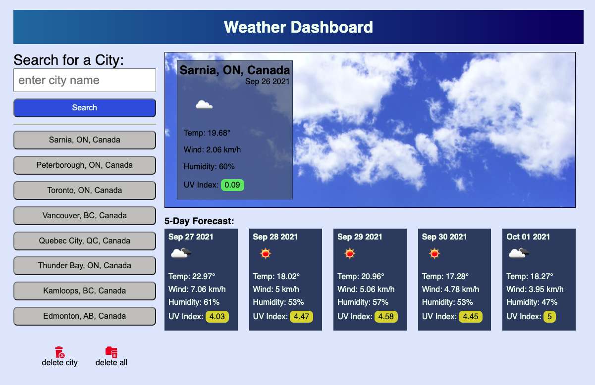

# Weather Forecaster
A fully functional and lightweight weather app written in JavaScript. 
[Click here](https://qcent.github.io/weather-forecast/) to try it out!

## Features
* Search for any city in the world resolved with [OpenCage Geocoding API](https://opencagedata.com/)
* View current conditions as well as a five day forecast provided by [OpenWeather One Call API](https://openweathermap.org/api/one-call-api)
* Create a persistent list of your favourite cities 
* Most recent city saved in localStorage for auto recall on page reload
* Easily remove individual cities from save list
* Remove all cities 
* Responsive scaling across all screen sizes
* DropDown menu of saved cities on narrow screen sizes

## 3rd Party APIs
This project is powered by and improved by several 3rd party organizations:
[OpenWeather One Call API](https://openweathermap.org/api/one-call-api) for weather data.
[OpenCage Geocoding API](https://opencagedata.com/) for forward geolocating. 
[Luxon](https://moment.github.io/luxon/#/?id=luxon) for processing datetime stamps.
[Google Fonts](https://fonts.google.com/) for fonts.
[svgrepo.com](https://www.svgrepo.com) provided the SVG icons
and royalty free images have been provided by
[FreeImages.com](https://images.freeimages.com)
[Pexels.com](https://www.pexels.com/)

## License
`weather-forecast` is Copyright 2021 Dave Quinn - Quinnco Enterprises.

`weather-forecast` is licensed under the [MIT License](https://opensource.org/licenses/MIT).

Copyright 2021 Dave Quinn

Permission is hereby granted, free of charge, to any person obtaining a copy of this software and associated documentation files (the "Software"), to deal in the Software without restriction, including without limitation the rights to use, copy, modify, merge, publish, distribute, sublicense, and/or sell copies of the Software, and to permit persons to whom the Software is furnished to do so, subject to the following conditions:

The above copyright notice and this permission notice shall be included in all copies or substantial portions of the Software.

THE SOFTWARE IS PROVIDED "AS IS", WITHOUT WARRANTY OF ANY KIND, EXPRESS OR IMPLIED, INCLUDING BUT NOT LIMITED TO THE WARRANTIES OF MERCHANTABILITY, FITNESS FOR A PARTICULAR PURPOSE AND NONINFRINGEMENT. IN NO EVENT SHALL THE AUTHORS OR COPYRIGHT HOLDERS BE LIABLE FOR ANY CLAIM, DAMAGES OR OTHER LIABILITY, WHETHER IN AN ACTION OF CONTRACT, TORT OR OTHERWISE, ARISING FROM, OUT OF OR IN CONNECTION WITH THE SOFTWARE OR THE USE OR OTHER DEALINGS IN THE SOFTWARE.

